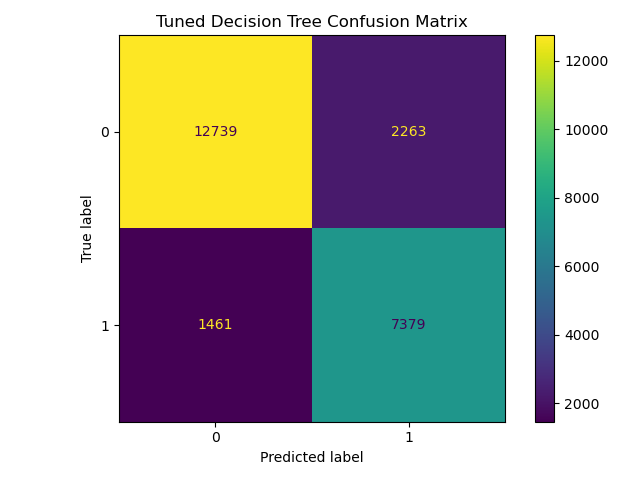
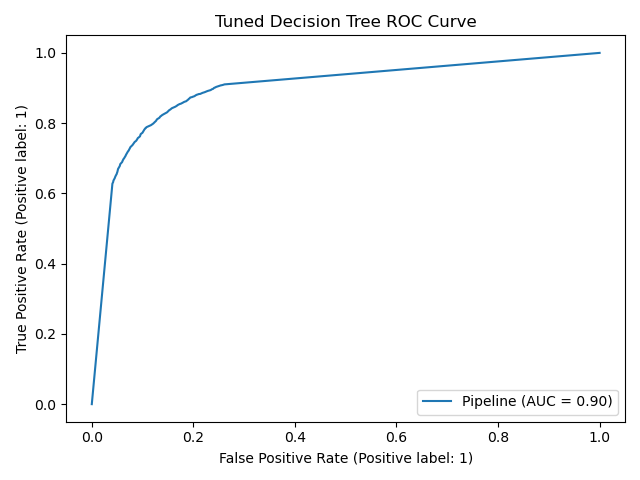
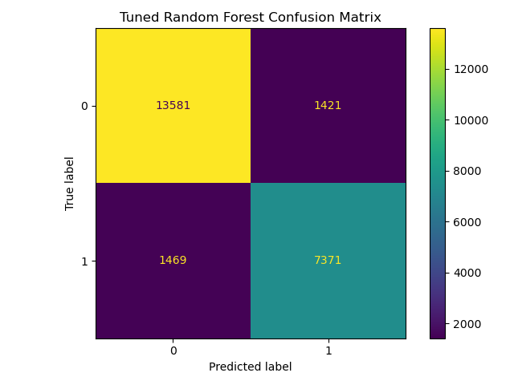
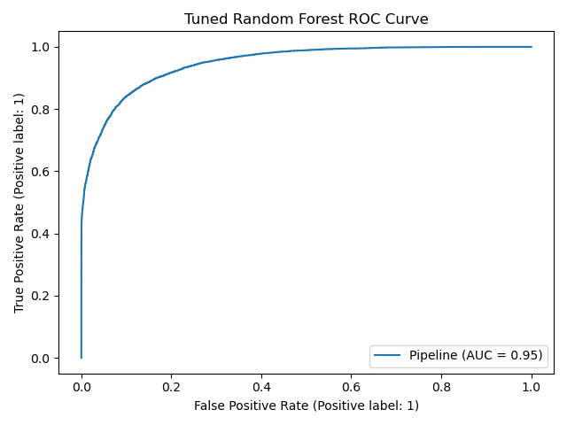
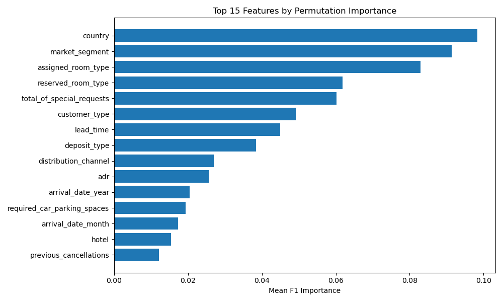

# Hotel Booking Cancellation Prediction using Decision Tree and Random Forest

## Project Overview

This project builds an end-to-end machine learning workflow to predict whether a hotel booking is likely to be cancelled.

Hotel booking cancellations can affect revenue forecasting, room availability, staffing, and overbooking decisions. The goal of this project is to identify bookings with higher cancellation risk using historical booking data.

The project compares two tree-based classification models:

* Decision Tree Classifier
* Random Forest Classifier

The workflow includes exploratory data analysis, data cleaning, feature engineering, preprocessing pipelines, cross-validation, hyperparameter tuning, model evaluation, feature importance analysis, reusable Python scripts, and Git/GitHub version control.

---

## Business Problem

Hotels often face uncertainty because customers may cancel bookings before arrival. If hotels can predict cancellation risk earlier, they can make better decisions around:

* Room availability planning
* Revenue forecasting
* Overbooking strategy
* Customer follow-up
* Staffing and operations

This project treats hotel booking cancellation prediction as a binary classification problem.

Target variable:

```text
is_canceled
```

Target meaning:

```text
0 = Booking not cancelled
1 = Booking cancelled
```

---

## Dataset

Dataset used: **Hotel Booking Demand Dataset**

The dataset contains hotel booking records from a city hotel and a resort hotel.

Main feature groups include:

* Hotel type
* Lead time
* Arrival date information
* Length of stay
* Number of guests
* Meal type
* Country
* Market segment
* Distribution channel
* Deposit type
* Previous cancellations
* Booking changes
* Average daily rate
* Special requests

The raw dataset is stored locally in:

```text
data/raw/hotels.csv
```

The dataset file is not pushed to GitHub because raw data files are ignored using `.gitignore`.

---

## Project Structure

```text
DT+RF/
│
├── data/
│   ├── raw/
│   │   └── .gitkeep
│   └── processed/
│       └── .gitkeep
│
├── images/
│   ├── tuned_decision_tree_confusion_matrix.png
│   ├── tuned_decision_tree_roc_curve.png
│   ├── tuned_random_forest_confusion_matrix.png
│   ├── tuned_random_forest_roc_curve.png
│   └── feature_importance.png
│
├── models/
│   └── .gitkeep
│
├── notebooks/
│   ├── 01_eda.ipynb
│   └── 02_model_experiments.ipynb
│
├── reports/
│   ├── cv_results_before_tuning.csv
│   ├── test_results.csv
│   └── feature_importance.csv
│
├── src/
│   ├── train.py
│   └── test.py
│
├── .gitignore
└── README.md
```

---

## Tools and Libraries

* Python
* pandas
* NumPy
* Matplotlib
* scikit-learn
* joblib
* Jupyter Notebook
* Git
* GitHub

---

## Machine Learning Workflow

```text
Raw data
   ↓
Exploratory Data Analysis
   ↓
Data cleaning
   ↓
Feature engineering
   ↓
Train-test split
   ↓
Preprocessing pipeline
   ↓
Baseline model
   ↓
Decision Tree model
   ↓
Random Forest model
   ↓
Cross-validation
   ↓
Hyperparameter tuning
   ↓
Test-set evaluation
   ↓
Feature importance analysis
   ↓
Model saving and testing
```

---

## Data Cleaning and Feature Engineering

The following cleaning and feature engineering steps were applied:

* Cleaned column names
* Removed target leakage columns:

  * `reservation_status`
  * `reservation_status_date`
* Created binary indicator features:

  * `has_agent`
  * `has_company`
  * `has_children`
* Created numerical features:

  * `total_nights`
  * `total_guests`
* Removed impossible bookings with zero guests
* Removed records with negative average daily rate
* Handled missing values through preprocessing pipelines

---

## Target Distribution

After cleaning, the dataset contained:

| Class | Meaning               |  Count |
| ----: | --------------------- | -----: |
|     0 | Booking not cancelled | 75,010 |
|     1 | Booking cancelled     | 44,199 |

This shows that the dataset is moderately imbalanced, so accuracy alone is not enough. Precision, recall, F1-score, and ROC-AUC were also used.

---

## Models Used

### 1. Baseline Dummy Classifier

A Dummy Classifier was used as a baseline model.

Purpose:

```text
To compare real machine learning models against a simple majority-class prediction.
```

---

### 2. Decision Tree Classifier

A Decision Tree was used because it is interpretable and can capture non-linear decision rules.

Example intuition:

```text
If deposit type is Non Refund
and lead time is high
then cancellation risk may be higher.
```

---

### 3. Random Forest Classifier

A Random Forest was used because it combines multiple decision trees to improve predictive performance and reduce overfitting.

---

## Preprocessing Pipeline

The project uses scikit-learn pipelines so that preprocessing is applied consistently during training, validation, testing, and future prediction.

Numeric features:

```text
Missing values → Median imputation
```

Categorical features:

```text
Missing values → Most frequent imputation
Categorical encoding → One-hot encoding
```

Pipeline structure:

```text
Raw input data
   ↓
ColumnTransformer
   ├── Numeric pipeline
   └── Categorical pipeline
   ↓
Machine learning model
```

---

## Cross-Validation Results

Before hyperparameter tuning, the models were evaluated using Stratified K-Fold cross-validation.

| Model                     | Accuracy | Precision | Recall | F1-score | ROC-AUC |
| ------------------------- | -------: | --------: | -----: | -------: | ------: |
| Baseline Dummy Classifier |    0.629 |     0.000 |  0.000 |    0.000 |   0.500 |
| Decision Tree             |    0.847 |     0.791 |  0.801 |    0.796 |   0.839 |
| Random Forest             |    0.885 |     0.889 |  0.789 |    0.836 |   0.953 |

The Random Forest model performed better than the Decision Tree during cross-validation, especially in F1-score and ROC-AUC.

---

## Hyperparameter Tuning

RandomizedSearchCV was used for hyperparameter tuning.

Decision Tree parameters included:

```text
criterion
max_depth
min_samples_split
min_samples_leaf
max_features
```

Random Forest parameters included:

```text
n_estimators
criterion
max_depth
min_samples_split
min_samples_leaf
max_features
bootstrap
```

F1-score was used as the main tuning metric because both false positives and false negatives matter in cancellation prediction.

---

## Final Test Set Results

After tuning, the models were evaluated on the test set.

| Model               | Accuracy | Precision | Recall | F1-score | ROC-AUC |
| ------------------- | -------: | --------: | -----: | -------: | ------: |
| Tuned Decision Tree |    0.844 |     0.763 |  0.840 |    0.799 |   0.921 |
| Tuned Random Forest |    0.890 |     0.861 |  0.838 |    0.849 |   0.957 |

The tuned Random Forest achieved the best overall performance.

Key result:

```text
Best model: Tuned Random Forest
Test Accuracy: 0.890
Test F1-score: 0.849
Test ROC-AUC: 0.957
```

---

## Confusion Matrix Results

### Tuned Decision Tree

| Actual / Predicted   | Predicted Not Cancelled | Predicted Cancelled |
| -------------------- | ----------------------: | ------------------: |
| Actual Not Cancelled |                  12,696 |               2,306 |
| Actual Cancelled     |                   1,418 |               7,422 |

Interpretation:

* Correctly predicted non-cancelled bookings: 12,696
* Correctly predicted cancelled bookings: 7,422
* False cancellations: 2,306
* Missed cancellations: 1,418

### Tuned Random Forest

| Actual / Predicted   | Predicted Not Cancelled | Predicted Cancelled |
| -------------------- | ----------------------: | ------------------: |
| Actual Not Cancelled |                  13,805 |               1,197 |
| Actual Cancelled     |                   1,430 |               7,410 |

Interpretation:

* Correctly predicted non-cancelled bookings: 13,805
* Correctly predicted cancelled bookings: 7,410
* False cancellations: 1,197
* Missed cancellations: 1,430

The Random Forest reduced false positives compared with the Decision Tree while keeping recall very similar.

---

## Model Evaluation Visuals

### Decision Tree Confusion Matrix



---

### Decision Tree ROC Curve



The tuned Decision Tree achieved an ROC-AUC score of approximately **0.92**.

---

### Random Forest Confusion Matrix



---

### Random Forest ROC Curve



The tuned Random Forest achieved an ROC-AUC score of approximately **0.96**.

---

## Feature Importance

Permutation importance was used to understand which features had the largest impact on model performance.

Top features:

| Rank | Feature                     | Mean F1 Importance |
| ---: | --------------------------- | -----------------: |
|    1 | country                     |              0.112 |
|    2 | market_segment              |              0.095 |
|    3 | assigned_room_type          |              0.080 |
|    4 | total_of_special_requests   |              0.066 |
|    5 | lead_time                   |              0.055 |
|    6 | reserved_room_type          |              0.053 |
|    7 | customer_type               |              0.050 |
|    8 | deposit_type                |              0.050 |
|    9 | adr                         |              0.039 |
|   10 | arrival_date_year           |              0.032 |
|   11 | distribution_channel        |              0.020 |
|   12 | required_car_parking_spaces |              0.020 |
|   13 | hotel                       |              0.019 |
|   14 | previous_cancellations      |              0.014 |
|   15 | booking_changes             |              0.013 |

### Feature Importance Plot



The most influential features included country, market segment, assigned room type, special requests, lead time, reserved room type, customer type, and deposit type.

---

## How to Run This Project

### 1. Clone the repository

```bash
git clone https://github.com/YOUR_USERNAME/YOUR_REPOSITORY_NAME.git
```

### 2. Move into the project folder

```bash
cd YOUR_REPOSITORY_NAME
```

### 3. Add the dataset

Place the dataset here:

```text
data/raw/hotels.csv
```

### 4. Install required libraries

```bash
pip install pandas numpy matplotlib scikit-learn joblib
```

### 5. Run the training workflow

```bash
python src/train.py
```

If using Anaconda Python on Windows:

```bash
"C:\Users\M.SRIMANREDDY\anaconda3\python.exe" src/train.py
```

### 6. Test the saved model

```bash
python src/test.py
```

If using Anaconda Python on Windows:

```bash
"C:\Users\M.SRIMANREDDY\anaconda3\python.exe" src/test.py
```

---

## Script Overview

### `src/train.py`

This script:

* Loads the dataset
* Cleans and engineers features
* Removes leakage columns
* Builds preprocessing pipelines
* Trains baseline, Decision Tree, and Random Forest models
* Runs cross-validation
* Performs hyperparameter tuning
* Evaluates tuned models
* Saves reports and images
* Saves the best model locally

### `src/test.py`

This script:

* Loads the saved model
* Loads and prepares the data
* Selects a sample booking
* Predicts cancellation outcome
* Prints the actual value, predicted value, and cancellation probability

---

## Git and GitHub Workflow

This project was tracked using Git and pushed to GitHub.

Initial Git setup:

```bash
git init
git add .
git commit -m "Initial hotel cancellation project with EDA and model experiments"
git branch -M main
git remote add origin <github-repo-url>
git push -u origin main
```

For later updates:

```bash
git status
git add .
git commit -m "Update project files"
git push
```

---

## Key Learnings

This project helped me practise:

* Building an end-to-end machine learning workflow
* Preventing target leakage
* Using preprocessing pipelines
* Applying cross-validation
* Performing hyperparameter tuning
* Comparing Decision Tree and Random Forest models
* Evaluating models with multiple metrics
* Interpreting feature importance
* Moving from notebooks to reusable Python scripts
* Using Git and GitHub for version control

---

## Future Improvements

Possible future improvements:

* Add XGBoost or LightGBM for comparison
* Add SHAP explanations for model interpretability
* Build a Streamlit app for interactive prediction
* Add a `requirements.txt` file
* Add automated tests
* Improve model threshold selection
* Compare results with and without operational features such as `assigned_room_type`

---

## Conclusion

This project demonstrates a complete machine learning workflow for hotel booking cancellation prediction using Decision Tree and Random Forest models.

The Random Forest model performed best, achieving:

```text
Accuracy: 0.890
F1-score: 0.849
ROC-AUC: 0.957
```

The project also shows how to move from notebook-based experimentation to a cleaner, reusable, and GitHub-ready machine learning project structure.
